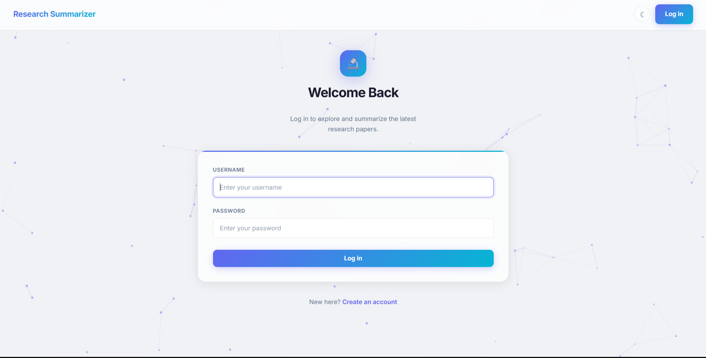
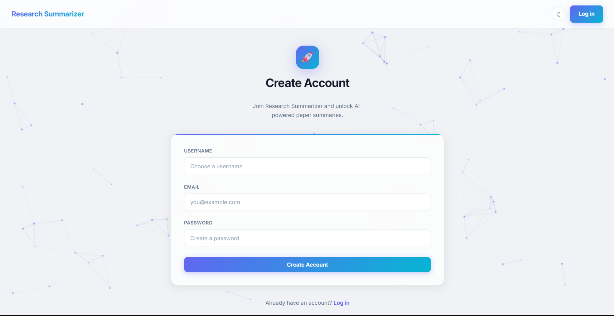
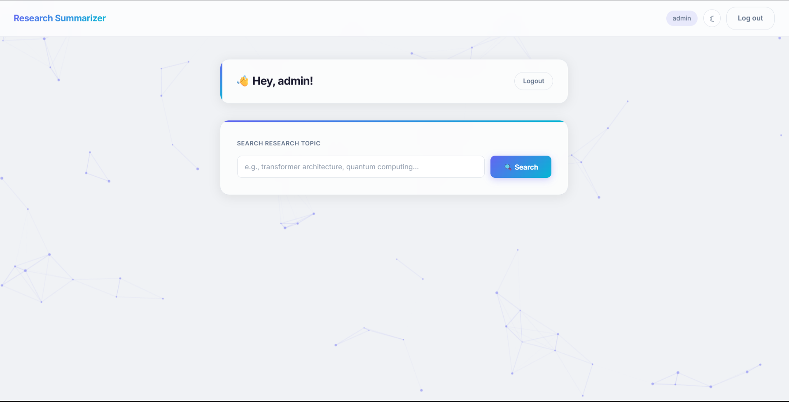
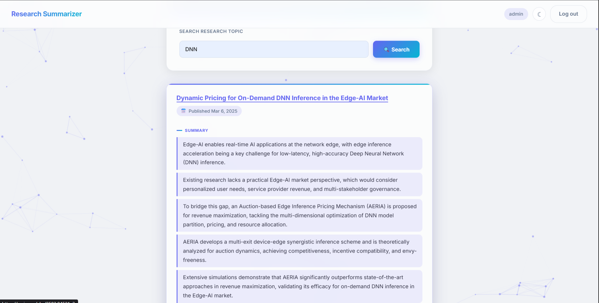
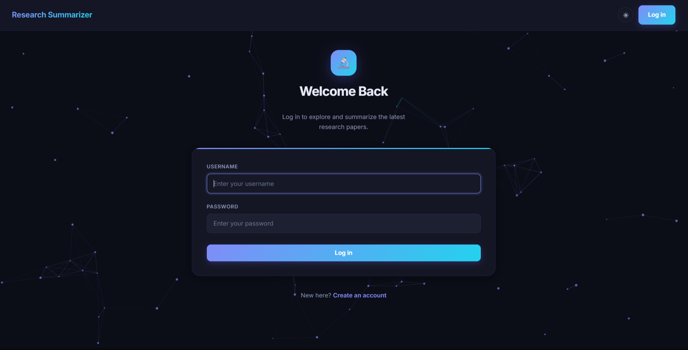

<div align="center">

# 🔬 Research Summarizer

**AI-powered research paper discovery & summarization**

Search any topic → Get top papers from arXiv → Read AI-generated bullet-point summaries in seconds.

[](https://python.org)
[](https://flask.palletsprojects.com)
[](https://ai.google.dev)
[](LICENSE)

[Features](#-features) · [Demo](#-demo) · [Screenshots](#-screenshots) · [Quick Start](#-quick-start) · [Tech Stack](#-tech-stack) · [Contributing](#contributing)

</div>

---

## ✨ Features

| Feature | Description |
|---------|-------------|
| 🔐 **User Authentication** | Secure register, login & logout with hashed passwords |
| 🔍 **Smart Search** | Search any research topic — fetches top papers from arXiv in real-time |
| 🤖 **AI Summaries** | Each paper's abstract is summarized into 5 concise bullet points using Google Gemini 2.5 Flash |
| 📄 **Paper Links** | Direct links to arXiv abstract & PDF for every result |
| 🌗 **Dark / Light Mode** | Toggle between themes — preference persists across sessions |
| ✨ **Animated UI** | Glassmorphism design, particle background, smooth card animations |
| ⚡ **AJAX Search** | No page reloads — results appear instantly via async fetch |

---

## 🎬 Demo

> 🎥 **[Watch the demo video on LinkedIn →](www.linkedin.com/in/saransh-bhardwaj-76b102353)**


## 📸 Screenshots

<div align="center">

### Login Page


### Register Page


### Dashboard


### Search Results with AI Summaries


### Dark Mode


</div>


## 🚀 Quick Start

### Prerequisites

- Python 3.10+
- A free [Google Gemini API key](https://aistudio.google.com/apikey)

### Installation

```bash
# 1. Clone the repo
git clone https://github.com/<saranshbhardwaj121>/research_summarizer.git
cd research_summarizer

# 2. Create & activate virtual environment
python -m venv venv
source venv/bin/activate      # Linux / Mac
venv\Scripts\activate         # Windows

# 3. Install dependencies
pip install -r requirements.txt

# 4. Set up environment variables
cp .env.example .env
# Edit .env and add your keys:
#   SECRET_KEY=your-secret-key
#   GEMINI_API_KEY=your-gemini-api-key

# 5. Run the app
python run.py
```

Open **http://127.0.0.1:5000** in your browser. Register an account, log in, and start searching!

---

## 🏗 Tech Stack

| Layer | Technology |
|-------|-----------|
| **Backend** | Flask 3.x, Flask-Login, Flask-SQLAlchemy |
| **Database** | SQLite |
| **AI Engine** | Google Gemini 2.5 Flash (REST API) |
| **Paper Source** | arXiv API |
| **Frontend** | Jinja2 Templates, Vanilla JS (AJAX), CSS3 |
| **Auth** | Werkzeug password hashing, Flask-Login sessions |
| **Design** | Glassmorphism, CSS variables, particle canvas |

---

## 📁 Project Structure

```
research_summarizer/
├── app/
│   ├── api/
│   │   ├── auth_routes.py      # Register, login, logout endpoints
│   │   └── main_routes.py      # Dashboard & search endpoints
│   ├── core/
│   │   └── extensions.py       # SQLAlchemy & LoginManager instances
│   ├── models/
│   │   └── user.py             # User model with password hashing
│   └── services/
│       ├── arxiv_service.py    # arXiv API integration
│       └── gemini_service.py   # Gemini AI summarization
├── static/
│   ├── css/style.css           # Full theme (light + dark)
│   └── js/main.js              # Search, theme toggle, particles
├── templates/
│   ├── base.html               # Layout with navbar & canvas
│   ├── login.html              # Login page
│   ├── register.html           # Registration page
│   └── dashboard.html          # Search & results page
├── assets/screenshots/         # App screenshots for README
├── config.py                   # Flask configuration
├── run.py                      # Application entry point
├── requirements.txt            # Python dependencies
├── .env.example                # Environment variable template
├── LICENSE                     # MIT License
└── README.md                   # You are here!
```

---

## ⚙️ Environment Variables

| Variable | Required | Description |
|----------|----------|-------------|
| `SECRET_KEY` | Yes | Flask session secret key |
| `GEMINI_API_KEY` | Yes | Google Gemini API key for AI summarization |

---

## 🤝 Contributing

Contributions are welcome! Please read the [Contributing Guide](CONTRIBUTING.md) to get started.

1. Fork the repo
2. Create your feature branch (`git checkout -b feature/amazing-feature`)
3. Commit your changes (`git commit -m 'Add amazing feature'`)
4. Push to the branch (`git push origin feature/amazing-feature`)
5. Open a Pull Request

---

## 📄 License

This project is licensed under the MIT License — see the [LICENSE](LICENSE) file for details.

---

## 🙋‍♂️ Author

**Saransh Bhardwaj**

[](https://www.linkedin.com/in/saransh-bhardwaj-76b102353/)
[](https://github.com/saranshbhardwaj121)

---

<div align="center">

**⭐ If you found this useful, give it a star!**

</div>